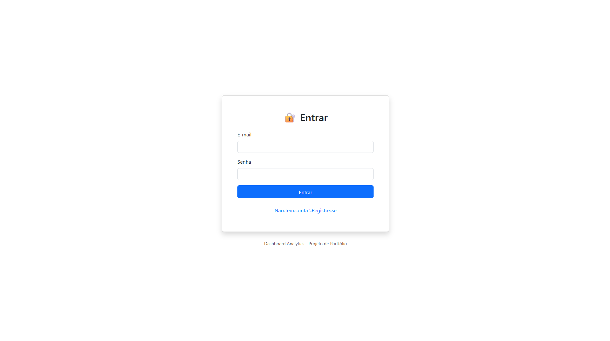
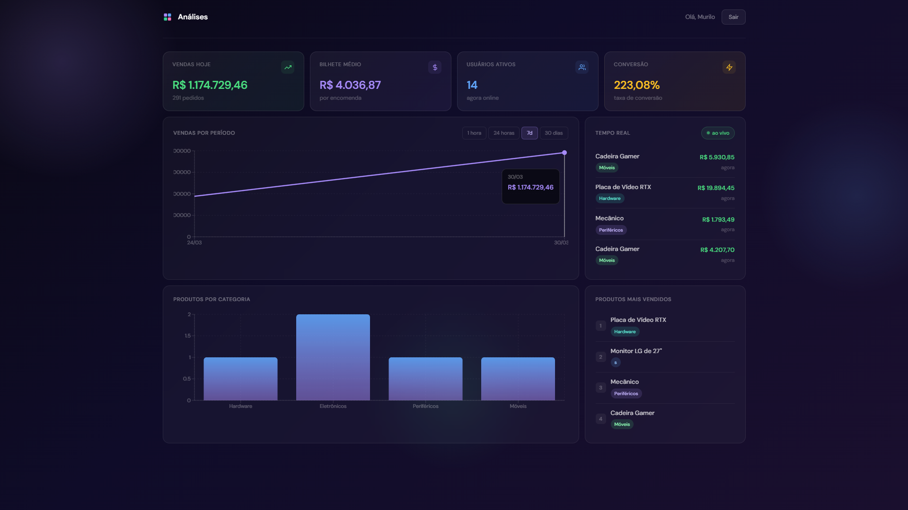

# 📊 Dashboard Analytics - Tempo Real

Sistema de dashboard analítico em tempo real desenvolvido com **React**, **Node.js**, **TypeScript**, **PostgreSQL** e **WebSocket**.


---

## 🎯 Sobre o Projeto

Dashboard Analytics é uma aplicação fullstack que exibe métricas de vendas e usuários em tempo real. Desenvolvido para demonstrar habilidades em:

- ✅ Desenvolvimento Fullstack (Frontend + Backend)
- ✅ TypeScript
- ✅ Comunicação em Tempo Real (WebSocket)
- ✅ Banco de Dados Relacional (PostgreSQL)
- ✅ Arquitetura REST API
- ✅ Autenticação JWT
- ✅ Docker
- ✅ Visualização de Dados

---

## ✨ Funcionalidades

### **Frontend**
- 🔐 Sistema de autenticação (Login/Registro)
- 📊 Dashboard com 4 métricas principais em tempo real
- 📈 Gráfico de vendas com filtros (1h, 24h, 7d, 30d)
- 🏷️ Gráfico de produtos por categoria
- 🔴 Feed de vendas ao vivo

### **Backend**
- 🔒 Autenticação JWT
- 🔌 WebSocket para comunicação em tempo real
- 📊 API REST com rotas protegidas
- 🗄️ ORM Sequelize com PostgreSQL
- 🎲 Gerador de dados simulados
- 📝 TypeScript com tipagem completa

---

## 🛠️ Tecnologias Utilizadas

### **Frontend**
- React 18
- TypeScript
- React Router DOM
- Axios
- Socket.IO Client
- Recharts (gráficos)
- Bootstrap 5

### **Backend**
- Node.js
- Express
- TypeScript
- Sequelize ORM
- PostgreSQL
- Socket.IO
- JWT (jsonwebtoken)
- Bcrypt

### **Infraestrutura**
- Docker (PostgreSQL)
- Docker Compose (opcional)

---

## 📋 Pré-requisitos

Antes de começar, você precisa ter instalado:

- [Node.js](https://nodejs.org/) (v18 ou superior)
- [Docker Desktop](https://www.docker.com/products/docker-desktop)
- [Git](https://git-scm.com/)

---

## 🚀 Como Executar o Projeto

### **1. Clonar o repositório**
```bash
git clone https://github.com/seu-usuario/dashboard-analytics.git
cd dashboard-analytics
```

### **2. Configurar o Banco de Dados (Docker)**
```bash

# Criar container PostgreSQL

# Aguardar 5 segundos
sleep 5

# Criar o banco de dados
docker exec -it postgres-analytics psql -U postgres -c "CREATE DATABASE dashboard_analytics;"
```

### **3. Configurar o Backend**
```bash
cd server

# Instalar dependências
npm install

# Criar arquivo .env

# Iniciar o servidor
npm run dev
```

**O servidor estará rodando em:** `http://localhost:5000`

### **4. Configurar o Frontend**
```bash
# Em outro terminal
cd client

# Instalar dependências
npm install

# Iniciar o React
npm start
```

**O frontend abrirá automaticamente em:** `http://localhost:3000`

---

## 👤 Primeiro Acesso

1. Acesse `http://localhost:3000`
2. Clique em **"Não tem conta? Registre-se"**
3. Preencha os dados:
   - Nome: Seu Nome
   - Email: seu@email.com
   - Senha: sua_senha
4. Faça login e acesse o dashboard!

---

## 📊 Estrutura do Projeto
```
dashboard-analytics/
├── client/                    # Frontend React
│   ├── public/
│   ├── src/
│   │   ├── contexts/         # Context API (Auth)
│   │   ├── pages/            # Páginas (Login, Dashboard)
│   │   ├── services/         # Comunicação com API
│   │   ├── types/            # Tipos TypeScript
│   │   ├── App.tsx
│   │   └── index.tsx
│   ├── package.json
│   └── tsconfig.json
│
├── server/                    # Backend Node.js
│   ├── src/
│   │   ├── config/           # Configuração do banco
│   │   ├── controllers/      # Lógica de negócio
│   │   ├── middleware/       # Middlewares (auth)
│   │   ├── models/           # Models Sequelize
│   │   ├── routes/           # Rotas da API
│   │   ├── utils/            # Utilitários
│   │   └── server.ts
│   ├── .env
│   ├── package.json
│
└── README.md
```

---

## 🔌 API Endpoints

### **Autenticação**
```http
POST /api/auth/register
Content-Type: application/json

{
  "name": "Nome",
  "email": "email@example.com",
  "password": "senha123"
}
```
```http
POST /api/auth/login
Content-Type: application/json

{
  "email": "email@example.com",
  "password": "senha123"
}
```

### **Métricas (Protegidas)**
```http
GET /api/metrics/dashboard
Authorization: Bearer {token}
```
```http
GET /api/metrics/sales/recent?limit=10
Authorization: Bearer {token}
```

---

## 🔄 WebSocket Events

### **Cliente → Servidor**
- `connect` - Conectar ao servidor

### **Servidor → Cliente**
- `new-sale` - Nova venda realizada
- `user-activity` - Atividade de usuário

**Exemplo de uso:**
```typescript
socket.on('new-sale', (sale) => {
  console.log('Nova venda:', sale);
});
```

---

## 🗄️ Models do Banco de Dados

### **User**
- `id` (PK)
- `email` (unique)
- `password` (hash)
- `name`
- `createdAt`
- `updatedAt`

### **Sale**
- `id` (PK)
- `productName`
- `amount`
- `price`
- `totalValue`
- `category`
- `createdAt`

### **ActiveUser**
- `id` (PK)
- `sessionId` (unique)
- `userAgent`
- `ipAddress`
- `createdAt`
- `updatedAt`

---

## 🎨 Screenshots

### Login


### Dashboard


---

## 🧪 Como Testar

### **Testar API com cURL**
```bash
# Registrar usuário
curl -X POST http://localhost:5000/api/auth/register \
  -H "Content-Type: application/json" \
  -d '{"name":"Test","email":"test@test.com","password":"123456"}'

# Login
curl -X POST http://localhost:5000/api/auth/login \
  -H "Content-Type: application/json" \
  -d '{"email":"test@test.com","password":"123456"}'

# Buscar métricas (substitua {TOKEN})
curl http://localhost:5000/api/metrics/dashboard \
  -H "Authorization: Bearer {TOKEN}"
```
---

## 🐛 Troubleshooting

### **Erro: "Database does not exist"**
```bash
docker exec -it postgres-analytics psql -U postgres -c "CREATE DATABASE dashboard_analytics;"
```

### **Erro: "Port 5432 already in use"**
```bash
# Parar outros serviços PostgreSQL
docker stop $(docker ps -q --filter ancestor=postgres)
```

### **Erro: "Cannot connect to WebSocket"**
- Verifique se o backend está rodando
- Verifique se não há firewall bloqueando a porta 5000

### **Dados não aparecem no gráfico**
- Aguarde alguns segundos para o gerador criar vendas
- Recarregue a página (F5)

---

## 📈 Melhorias Futuras

- [ ] Testes unitários e integração
- [ ] Deploy em produção (Vercel + Railway)
- [ ] Dashboard de administração
- [ ] Filtros avançados
- [ ] Export de relatórios (PDF/Excel)
- [ ] Notificações push
- [ ] Modo escuro
- [ ] Múltiplos idiomas

---

## 👨‍💻 Autor

**Seu Nome**

- LinkedIn: https://www.linkedin.com/in/murilo-oliveira-668b36a9/
- GitHub: https://github.com/MuriloOz

---

## 📄 Licença

Este projeto está sob a licença MIT. Veja o arquivo [LICENSE](LICENSE) para mais detalhes.

---

## 🙏 Agradecimentos

Projeto desenvolvido como parte do portfólio para demonstrar habilidades em desenvolvimento fullstack.

---

## ⭐ Dê uma Estrela!

Se este projeto te ajudou de alguma forma, considere dar uma ⭐ no repositório!